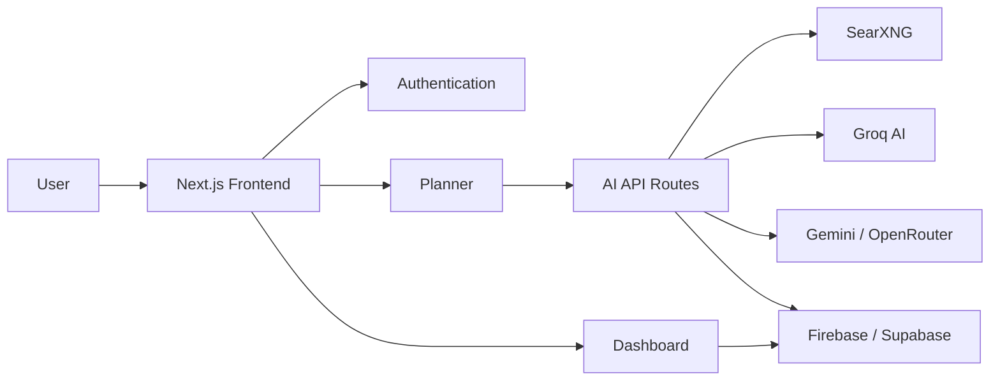

# Torus AI - Project Documentation

## 1. Project Name & GitHub URL

**Project Name:** Torus AI

**GitHub URL:** https://github.com/Bvs2006/TorusAi.git

Torus AI is an AI-powered project planning platform that helps users convert a project idea into a technology stack, architecture plan, development roadmap, and useful AI prompts.

---

## 2. Description & Requirements

Torus AI is built for students, developers, and teams who want to plan software projects faster. Users enter an idea, and the system generates project guidance using AI and search-backed recommendations.

### Requirements

- User signup, login, and protected dashboard access.
- Project idea submission.
- AI-generated technology stack recommendations.
- Feature, architecture, and implementation phase planning.
- Project progress tracking.
- Error-fix assistant and AI tool directory.
- Team workflow support.
- Responsive UI for desktop and mobile.
- Secure use of environment variables and authentication.

---

## 3. Problem Statement & Proposed Solution

### Problem Statement

Developers often spend too much time deciding which technologies to use and how to structure a new project. Beginners and small teams may also struggle to create a clear roadmap before development starts.

### Proposed Solution

Torus AI solves this by generating a structured project plan from a simple idea. It recommends tools, creates implementation phases, supports architecture planning, and provides AI prompts that help users begin development quickly.

---

## 4. Technologies

Next.js 14, React 18, TypeScript, Tailwind CSS, Firebase, Supabase, Groq SDK, Gemini API, OpenRouter API, SearXNG, ReactFlow, Recharts, Lucide React, html2canvas, jsPDF, PostgreSQL, Vercel, Node.js, npm

---

## 5. System Architecture

The frontend is built with Next.js and React. API routes handle AI planning, feature generation, prompts, error fixing, streaks, and team workflows. Firebase and Supabase utilities support authentication and data storage. Groq is used as the primary AI provider, with Gemini and OpenRouter as fallback options.

---

## 6. In Scope & Out of Scope

### In Scope

- AI-based project planning.
- Technology stack recommendations.
- Feature and phase generation.
- Architecture guidance.
- Dashboard and progress tracking.
- Error-fix assistant.
- Tool directory.
- Team workflow features.

### Out of Scope

- Fully automatic complete app development.
- Direct project deployment from the platform.
- Payment or subscription system.
- Native mobile applications.
- Enterprise audit and compliance features.
- Offline-only usage.

---

## 7. Future Enhancements & Conclusion

### Future Enhancements

- Real-time team collaboration.
- Project export as PDF, Markdown, or JSON.
- GitHub repository generation.
- More integrations with developer tools.
- Advanced analytics and deployment checks.

### Conclusion

Torus AI helps users move from idea to execution faster by providing AI-generated planning, architecture, and development guidance. It is useful for students, developers, hackathon teams, and startups that need quick and clear project direction.
